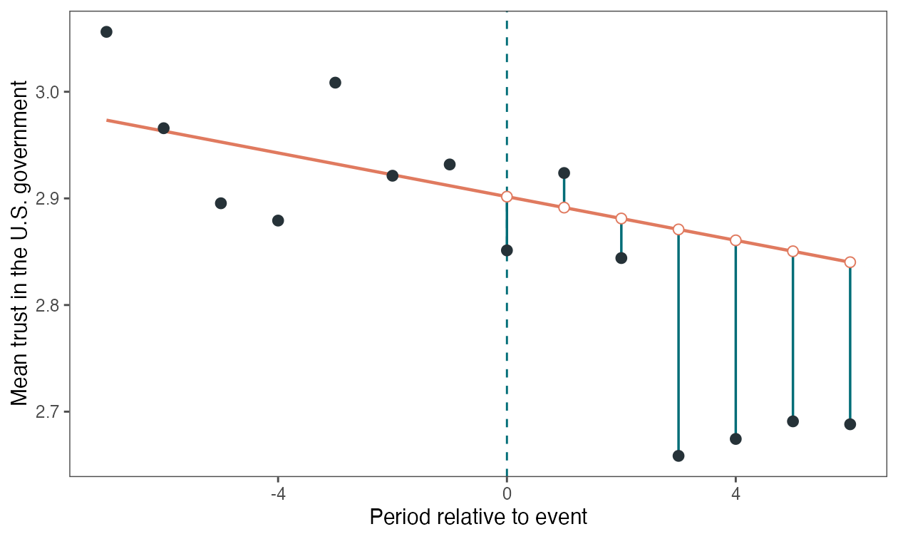
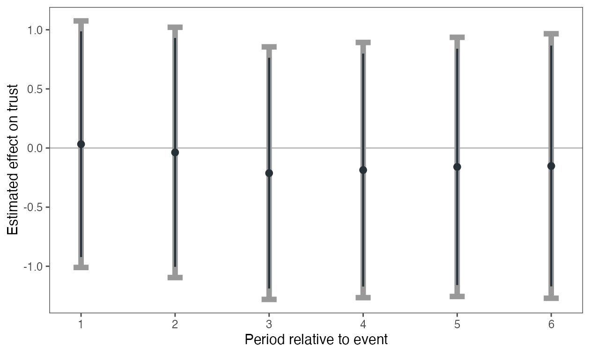
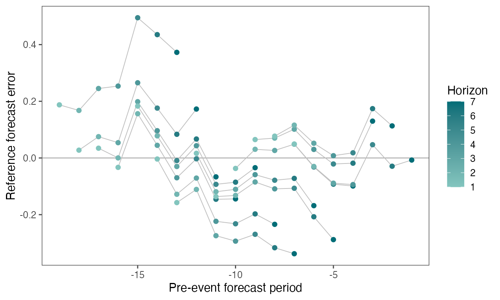

```{r, include = FALSE}
knitr::opts_chunk$set(collapse = TRUE, comment = "#>", fig.width = 7, fig.height = 4.2)
```

This article reproduces the `eventsurvey` reanalysis of Bateson and Weintraub
(2022), not the article's full covariate-adjusted research design. The outcome
codes trust in the U.S. government from 1 (untrustworthy) to 4 (very
trustworthy). Day zero is the November 8, 2016 U.S. election.

```{r}
library(eventsurvey)
```

The underlying AmericasBarometer respondent files are available from
[LAPOP/CGD](https://www.vanderbilt.edu/cgd/data-access/). Its current terms
require every user to obtain the data directly and prohibit redistribution.
For that reason, neither respondent records nor derived daily data are bundled
with `eventsurvey`. The original study's code and replication notes are
archived in [Harvard Dataverse](https://doi.org/10.7910/DVN/YRJ6E3).

## Prepare an authorized local copy

After obtaining the four country files and constructing the source analysis
file following the original replication code, point the environment variable
to that file. The repository helper creates `bateson` in memory and does not
copy source data into the package.

```{r prepare, eval = FALSE}
Sys.setenv(EVENTSURVEY_BATESON_DATA = "/path/to/cleaned_main.csv")
source("data-raw/prepare-bateson-local.R")

stopifnot(nrow(bateson) == 51L, min(bateson$day) == -26L)
```

## Daily fieldwork

The two panels below were generated from the authorized local data with
`plot(fit_bateson, type = "daily")` and `plot(fit_bateson, type = "counts")`.
The dashed line marks election day.

```{r bateson-daily, echo = FALSE, fig.show = 'hold', out.width = '49%', fig.cap = 'Daily outcome means and respondent counts around the 2016 U.S. election.'}
knitr::include_graphics(c(
  "figures/bateson-daily-means.png",
  "figures/bateson-daily-counts.png"
))
```

## Primary seven-day analysis

Election day is forecast as horizon 1 to preserve calendar time, but it is not
reported because interviews could have occurred before or after the result was
known. Reported post day 1 is therefore forecast horizon 2.

```{r primary, eval = FALSE}
fit_bateson <- eventsurvey_summary(mean ~ day, bateson,
  n = n, variance = variance, event_time = 0, window = 7,
  event_day = "include", report_event_day = FALSE
)
fit_bateson$estimate
```

```{r bateson-counterfactual, echo = FALSE, fig.cap = 'Observed trust and the extrapolated no-election counterfactual. Vertical segments show the day-specific difference between the observed and counterfactual means.'}

```

```{r bateson-effects, echo = FALSE, fig.cap = 'Day-specific post-election effects. Thick gray intervals are 95% honest intervals; thin black intervals are 90% honest intervals.'}

```

The 26 consecutive pre-election dates yield 13 rolling placebo windows and 91
reference errors. With the authorized local data, the command above returns an
average effect of -0.109, a bias bound of 0.495, and a 95% honest interval of
[-1.154, 0.936]. The day-specific results reported in the manuscript are:

```{r table}
bateson_reported <- data.frame(
  post_day = 1:6,
  respondents = c(105, 109, 123, 129, 110, 93),
  estimate = c(0.032, -0.037, -0.212, -0.186, -0.159, -0.152),
  bias_bound = rep(0.495, 6),
  conf_low = c(-1.010, -1.095, -1.280, -1.265, -1.256, -1.270),
  conf_high = c(1.075, 1.021, 0.856, 0.893, 0.937, 0.966)
)
knitr::kable(bateson_reported, digits = 3,
             col.names = c("Post day", "Respondents", "Estimate", "Bias bound",
                           "95% low", "95% high"))
```

Every 95% interval includes zero. The negative point estimates from post day 2
onward therefore cannot be distinguished from the extrapolation error observed
in the matched pre-event forecasts.

## Rolling diagnostics and sensitivity

```{r diagnostics, eval = FALSE}
plot(fit_bateson, type = "daily")
plot(fit_bateson, type = "counterfactual")
plot(fit_bateson, type = "effects")
plot(fit_bateson, type = "diagnostics")
```

```{r bateson-diagnostics, echo = FALSE, fig.cap = 'Rolling pre-event forecast errors used to calibrate the misspecification bound.'}

```

```{r sensitivity, eval = FALSE}
bateson_sensitivity <- do.call(rbind, lapply(3:10, function(w) {
  fit <- eventsurvey_summary(mean ~ day, bateson,
    n = n, variance = variance, event_time = 0, window = w,
    report_event_day = FALSE
  )
  cbind(window = w, fit$estimate[c("effect", "bias_bound", "conf_low", "conf_high", "n_windows")])
}))
knitr::kable(bateson_sensitivity, digits = 3)
```

The expected sensitivity output is shown below so an authorized user can check
the complete run.

```{r sensitivity-expected}
bateson_sensitivity_expected <- data.frame(
  window = 3:10,
  effect = c(0.045, -0.159, -0.203, -0.170, -0.109, -0.084, -0.075, -0.108),
  bias_bound = c(0.724, 0.446, 0.574, 0.443, 0.495, 0.353, 0.445, 0.466),
  conf_low = c(-2.624, -2.146, -1.954, -1.250, -1.154, -0.903, -0.984, -1.019),
  conf_high = c(2.714, 1.827, 1.548, 0.911, 0.936, 0.715, 0.848, 0.832),
  n_windows = c(21, 19, 17, 15, 13, 11, 9, 7)
)
knitr::kable(bateson_sensitivity_expected, digits = 3)
```

## Reference

Bateson, Regina, and Michael Weintraub. 2022. "The 2016 Election and
America's Standing Abroad: Quasi-experimental Evidence of a Trump Effect."
*Journal of Politics* 84(4): 2300--2304.
[Article](https://doi.org/10.1086/718209) ·
[Replication materials](https://doi.org/10.7910/DVN/YRJ6E3)
